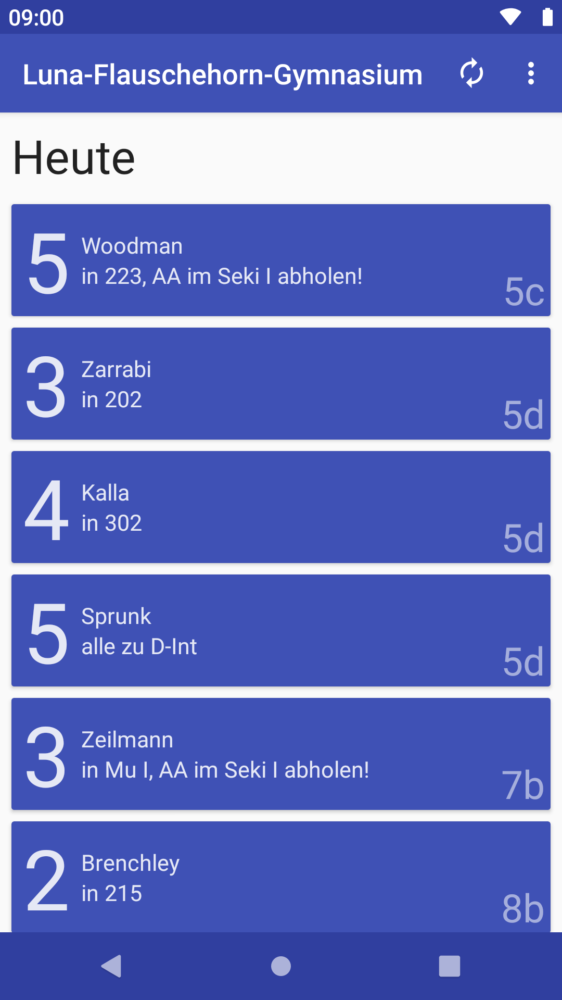

# DSBDirect
This Android client software can access a certain **substitution plan** distribution system (aliased **ESB** for *Elektronisches Schwarzes Brett*) which is widely spread in the German-speaking area.

It has been developed independently from heinekingmedia and implements the same functionality as their app.

* Displays entries in a nice, native list which you can filter
* Alternatively displays the raw website or image
* View older versions of your plan, stored locally
* Notifications containing your only entries
* Replace shortcodes with teacher's full names
* View the "News" and "Aushänge" sections
* Loads relatively quickly

## Download (original version)

Android 4.0 and up. Notification on Android 5 and up. (Nowadays, nobody has Android 4 anymore. Truly.) 

### [Download via release page](https://notabug.org/fynngodau/DSBDirect/releases) | [Download on F-Droid](https://f-droid.org/de/packages/godau.fynn.dsbdirect/) | [Download on Google Play](https://play.google.com/store/apps/details?id=ga.testapp.dsbdirect)

Code mirrors: [notabug.org](https://notabug.org/fynngodau/DSBDirect) | [Codeberg](https://codeberg.org/fynngodau/DSBDirect) | [F-Droid source tarballs](https://f-droid.org/packages/godau.fynn.dsbdirect) | [GitLab](https://gitlab.com/fynngodau/dsbdirectmirror)

## Screenshots

| **Main view**  | **Notice board**  |
|:------:|:------:|
| **List view with dark theme**  | **Offline history**  |

